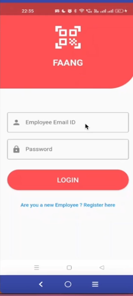
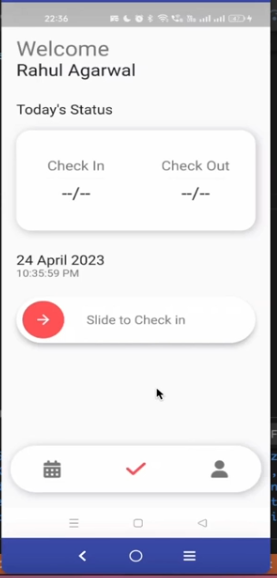
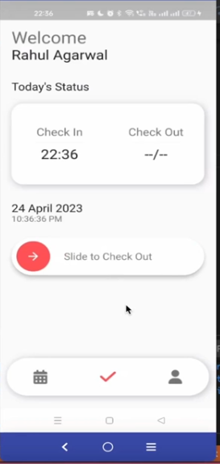
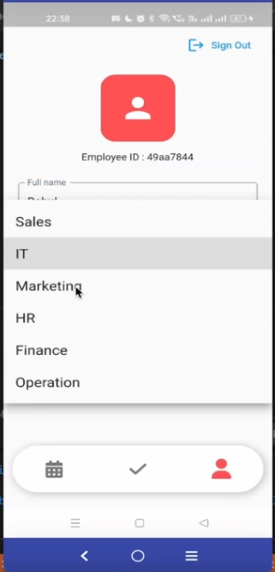
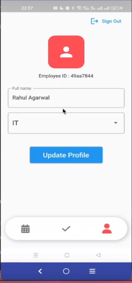
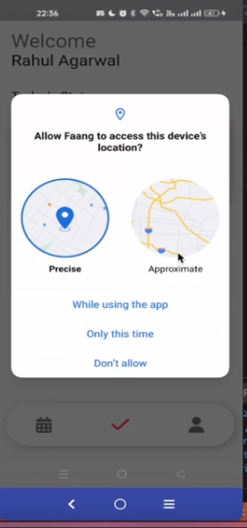
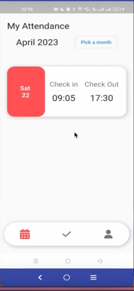

#  Attendance App (Flutter + Supabase)

A modern **Attendance Management App** built with **Flutter** and **Supabase** — designed to help organizations or teams track employee attendance, manage user profiles, and update department data seamlessly in real time.

---

## 🚀 Features

- **Supabase Authentication** – Secure login and user management  
- **Realtime Attendance Tracking** – Record check-ins and check-outs  
- **Department Management** – Manage employee departments and assignments  
- **Profile Management** – Update user info directly in Supabase  
- **Responsive UI** – Clean, simple, and mobile-friendly design  
- **Provider State Management** – Efficient data flow across widgets  

---

##  Tech Stack

| Layer | Technology |
|-------|-------------|
| **Frontend** | Flutter (Dart) |
| **Backend** | Supabase (PostgreSQL + Auth + Storage) |
| **State Management** | Provider |
| **Database Access** | Supabase Dart Client |
| **Authentication** | Supabase Auth (email-based) |

---

# Screenshots
|     |     |    |      |
|------|------|-------|-------|
|
 |
  || 
|
|

